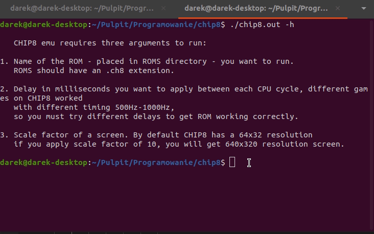
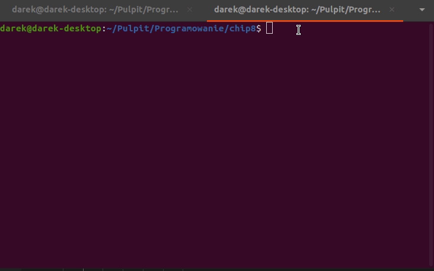

# chip8

C++ implementation of CHIP8.
Emulator is fully functional and can run any ROM.

## Requirements

Only requirement for building process is SDL2 library.

## Examples

**Test ROMS:**

**Pong:**

**Tetris:**

**Brick:**

